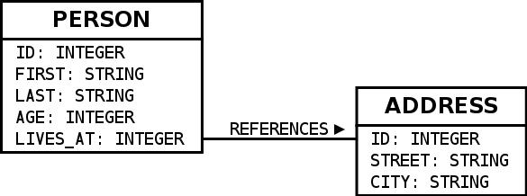

Coming from SQL to Slick
=========================

Coming from JDBC/SQL to Slick is pretty straight forward in many ways. Slick can be considered as a drop-in replacement with a nicer API for handling connections, fetching results and using a query language, which is integrated more nicely into Scala than writing queries as Strings. The main obstacle for developers coming from SQL to Slick seems to be the semantic differences of seemingly similar operations between SQL and Scala's collections API which Slick's API imitates. The following sections give a quick overview over the differences. They start with conceptual differences and then list examples of many :ref:`SQL operators and their Slick equivalents <sql-to-slick-operators>`. For a more detailed explanations of Slick's API please refer to :doc:`chapter queries <queries>` and the equivalent methods in the :scalaapi:`the Scala collections API <scala.collection.immutable.Seq>`.

Schema
--------------------------------

This document uses the following database schema

mapped to Slick using the following code:

.. includecode:: code/SqlToSlick.scala#tableClasses

Tables can alternatively be mapped to case classes. Similar code can be :doc:`auto-generated <code-generation>` or :doc:`hand-written <schemas>`.

Queries in comparison
--------------------------------

JDBC Query
___________

A jdbc query could with error handling look like this

.. includecode:: code/SqlToSlick.scala#jdbc

Slick gives us two choices how to write queries. One is SQL strings just like JDBC. The other are type-safe, composable queries.

Slick Plain SQL queries
_________________________

This is useful if you either want to continue writing queries in SQL or if you need a feature not (yet) supported by Slick otherwise. Executing the same query using Slick Plain SQL, which has built-in error-handling and closing of resources looks like this:

.. includecode:: code/SqlToSlick.scala#SlickPlainSQL

``.list`` returns a list of results. ``.first`` a single result. ``.foreach`` can be used to iterate over the results without ever materializing all results at once.

Slick type-safe, composable queries
________________________________________

Slick's key feature are type-safe, composable queries. Slick comes with a Scala-to-SQL compiler, which allows a (purely functional) sub-set of the Scala language to be compiled to SQL queries. Also available are a subset of the standard library and some extensions, e.g. for joins. The familiarity allows Scala developers to instantly write many queries against all supported relational databases with little learning required and without knowing SQL or remembering the particular dialect. Such Slick queries are composable, which means that you can write and re-use fragments and functions to avoid repetitive code like join conditions in a much more practical way than concatenating SQL strings. The fact that such queries are type-safe not only catches many mistakes early at compile time, but also eliminates the risk of SQL injection vulnerabilities.

The same query written as a type-safe Slick query looks like this:

.. includecode:: code/SqlToSlick.scala#SlickTypesafeQuery

``.run`` automatically returns a Seq for collection-like queries and a single value for scalar queries. ``.list``, ``.first`` and ``.foreach`` are also available.

A key benefit compared to SQL strings is, that you can easily transform the query by calling more methods on it. E.g. ``query.filter(_.age > 18)`` returns transformed query which further restricts the results. This allows to build libraries of queries, which re-use each other become much more maintainable. You can abstract over join conditions, pagination, filters, etc.

.. Add a link to more info on this

It is important to note that Slick needs the type-information to type-check these queries. This type information closely corresponds to the database schema and is provided to Slick in the form of Table sub classes and TableQuery values shown above.

Main obstacle: Semantic API differences
---------------------------------------------------------

Some methods of the Scala collections work a bit differently than their SQL counter parts. This seems to be one of the main causes of confusion for people newly coming from SQL to Slick. Especially `groupBy`_ seems to be tricky. Also `leftJoin`_ because of some complications with Slick's current integration.

The best approach to write queries using Slick's type-safe api is thinking in terms of Scala collections. What would the code be if you had a Seq of tuples or case classes instead of a Slick TableQuery object. Use that exact code. If needed adapt it with workarounds where a Scala library feature is currently not supported by Slick or if Slick is slightly different. Some operations are more strongly typed in Slick than in Scala for example. Arithmetic operation in different types require explicit casts using `.asColumnOf[T]`. Also Slick uses 3-valued logic for Option inference.

Scala-to-SQL compilation during runtime
---------------------------------------------------------

Slick runs a Scala-to-SQL compiler to implement its type-safe query feature. The compiler runs at Scala run-time and it does take its time which can even go up to second or longer for complex queries. It can be very useful to run the compiler only once per defined query and upfront, e.g. at app startup instead of each execution over and over. :ref:`Compiled queries <compiled-queries>` allow you to cache the generated SQL for re-use.

Limitations
---------------------------------------------------------

When you use Slick extensively you will run into cases, where Slick's type-safe query language does not support a query operator or JDBC feature you may desire to use or produces non-optimal SQL code. There are several ways to deal with that.

Missing query operators
________________________________________________________

Slick is extensible to some degree, which means you can add some kinds of missing operators yourself. 

Definition in terms of others
^^^^^^^^^^^^^^^^^^^^^^^^^^^^^

If the operator you desire is expressible using existing Slick operations you can simply write a Scala function or implicit class that implements the operator as a method in terms of existing operators. Here we implement ``squared`` using multiplication.

.. includecode:: code/SqlToSlick.scala#slickFunction

Definition using a database function
^^^^^^^^^^^^^^^^^^^^^^^^^^^^^^^^^^^^

If you need a fundamental operator, which is not supported out-of-the-box you can add it yourself if it operates on scalar values. For example Slick currently does not have a ``power`` method out of the box. Here we are mapping it to a database function.

.. includecode:: code/SqlToSlick.scala#dbFunction

More information can be found in the chapter about :ref:`Scalar database functions <scalar-db-functions>`.

You can however not add operators operating on queries using database functions. The Slick Scala-to-SQL compiler requires knowledge about the structure of the query in order to compile it to the most simple SQL query it can produce. It currently couldn't handle custom query operators in that context. (There are some ideas how this restriction can be somewhat lifted in the future, but it needs more investigation). An example for such operator is a MySQL index hint, which is not supported by Slick's type-safe api and it cannot be added by users. If you require such an operator you have to write your whole query using Plain SQL. If the operator does not change the return type of the query you could alternatively use the workaround described in the following section.

Unsupported JDBC features
________________________________________________________

There are some JDBC feature Slick simply doesn't currently support. Some of these are OUT-Parameters, stored procedures returning tables, multiple result sets. Often you can still use them by simply accessing the JDBC connection underlying a Slick session. More info can be found in the section about :ref:`JDBC interop <jdbc-interop>`. 

Non-optimal SQL code
________________________________________________________

Slick generates SQL code and tries to make it as simple as possible. The algorithm doing that is not perfect and under continuous improvement. There are cases where the generated queries are more complicated than someone would write them by hand. This can lead to bad performance for certain queries with some optimizers and DBMS. For example, Slick occasionally generates unnecessary sub-queries. In MySQL <= 5.5 this easily leads to unnecessary table scans or indices not being used. The Slick team is working towards generating code better factored to what the query optimizers can currently optimize, but that doesn't help you now. To work around it you have to write the more optimal SQL code by hand. You can either run it as a Slick Plain SQL query or you can `use a hack <https://gist.github.com/cvogt/d9049c63fc395654c4b4>`_, which allows you to simply swap out the SQL code Slick uses for a type-safe query.

.. includecode:: code/SqlToSlick.scala#overrideSql

.. _sql-to-slick-operators:

SQL vs. Slick examples
--------------------------------

This sections shows an overview over the most important types of SQL queries and a corresponding type-safe Slick query.

.. index:: select, map, projection, *

select *
____________

SQL
^^^

.. includecode:: code/SqlToSlick.scala#sqlQueryProjection*

Slick
^^^^^^
The Slick equivalent of ``select *`` is just calling ``run`` on a table.

.. includecode:: code/SqlToSlick.scala#slickQueryProjection*

.. index:: select, map, projection

select
____________

SQL
^^^

.. includecode:: code/SqlToSlick.scala#sqlQueryProjection

Slick
^^^^^^
Scala's equivalent for ``select`` is ``map``. Columns can be referenced similarly and functions operating on columns can be accessed using their Scala eqivalents (but allowing only ``++`` for String concatenation, not ``+``).

.. includecode:: code/SqlToSlick.scala#slickQueryProjection

.. index:: where, filter, or, and, &&, ||, ==

where
____________

SQL
^^^

.. includecode:: code/SqlToSlick.scala#sqlQueryFilter

Slick
^^^^^^
Scala's equivalent for ``where`` is ``filter``. Make sure to use ``===`` instead of ``==`` for comparison.

.. includecode:: code/SqlToSlick.scala#slickQueryFilter

.. index:: sort, order by, sortBy

order by
____________

SQL
^^^

.. includecode:: code/SqlToSlick.scala#sqlQueryOrderBy

Slick
^^^^^^
Scala's equivalent for ``order by`` is ``sortBy``. Provide a tuple to sort by multiple columns. Slick's ``.asc`` and ``.desc`` methods allow to affect the ordering. Be aware that a single ``order by`` with multiple columns is not equivalent to multiple ``.sortBy`` calls but to a single ``.sortBy`` call passing a tuple.

.. includecode:: code/SqlToSlick.scala#slickQueryOrderBy

.. index:: groupBy, group by, max, min, avg, sum, count, length, size

Aggregations (max, etc.)
_________________________

SQL
^^^

.. includecode:: code/SqlToSlick.scala#sqlQueryAggregate

Slick
^^^^^^
Aggregations are collection methods in Scala. In SQL they are called on a column, but in Slick they are called on collection-like value e.g. a complete query, which people coming from SQL easily trip over. They return a scalar value, which can be run individually. Aggregation methods such as ``max`` that can return ``NULL`` return Options in Slick.

.. includecode:: code/SqlToSlick.scala#slickQueryAggregate

.. index:: groupBy, group by, max, min, avg, sum, count, length, size

.. _groupBy:

group by
____________

People coming from SQL often seem to have trouble understanding Scala's and Slick's ``groupBy``, because of the different signatures involved. SQL's group by can be seen as an operation that turns all columns that weren't part of the grouping key into collections of all the elements in a group. SQL requires the use of it's aggregation operations like ``avg`` to compute single values out of these collections.

SQL
^^^

.. includecode:: code/SqlToSlick.scala#sqlQueryGroupBy

Slick
^^^^^^
Scala's groupBy returns a Map of grouping keys to Lists of the rows for each group. There is no automatic conversion of individual columns into collections. This has to be done explicitly in Scala, by mapping from the group to the desired column, which then allows SQL-like aggregation.

.. includecode:: code/SqlToSlick.scala#slickQueryGroupBy

SQL requires to aggregate grouped values. We require the same in Slick for now. This means a ``groupBy`` call must be followed by a ``map`` call or will fail with an Exception. This makes Slick's grouping syntax a bit more complicated than SQL's. We may lift this restriction by providing an alternative method with a different signature at some point.

.. index:: having

having
____________

SQL
^^^

.. includecode:: code/SqlToSlick.scala#sqlQueryHaving

Slick
^^^^^^
Slick does not have different methods for ``where`` and ``having``. For achieving semantics equivalent to ``having``, just use ``filter`` after ``groupBy`` and the following ``map``.

.. includecode:: code/SqlToSlick.scala#slickQueryHaving

.. index:: join, implicit join, flatMap

Implicit join
______________

SQL
^^^

.. includecode:: code/SqlToSlick.scala#sqlQueryImplicitJoin

Slick
^^^^^^
Slick generates SQL using implicit joins for ``flatMap`` and ``map`` or the corresponding for-expression syntax.

.. includecode:: code/SqlToSlick.scala#slickQueryImplicitJoin

.. index:: explicit join

Explicit join
________________

SQL
^^^

.. includecode:: code/SqlToSlick.scala#sqlQueryExplicitJoin

Slick
^^^^^^
Slick offers a small DSL for explicit joins.

.. includecode:: code/SqlToSlick.scala#slickQueryExplicitJoin

.. index:: outer join, left join, leftJoin, rightJoin, right join

.. _leftJoin:

left/right/outer join
_______________________

SQL
^^^

.. includecode:: code/SqlToSlick.scala#sqlQueryLeftJoin

Slick
^^^^^^
Outer joins are done using Slick's explicit join DSL. Be aware that in case of an outer join SQL changes the type of outer joined, non-nullable columns into nullable columns. Slick isn't aware of this, which is a known limitation at the moment. When Slick encounters a null for an originally non-nullable column when fetching outer join results, a ``Read NULL value for column`` SlickException is thrown. In order to avoid this, you need to tell Slick explicitly using the ``.?`` which columns can now be nullable, which are all originally non-nullable columns that were outer-joined. Slick currently supports ``.?`` only for individual columns, not tuples or rows. The Slick code generator generates ``.?`` methods for complete rows of the handled tables, which eases the situation a bit.

.. includecode:: code/SqlToSlick.scala#slickQueryLeftJoin

.. index:: subquery, nested query

Subquery
____________

SQL
^^^

.. includecode:: code/SqlToSlick.scala#sqlQueryCollectionSubQuery

Slick
^^^^^^
Slick queries are composable. Subqueries can be simply composed, where the types work out, just like any other Scala code.

.. includecode:: code/SqlToSlick.scala#slickQueryCollectionSubQuery

The method ``.in`` expects a sub query. For an in-memory Scala collection, the method ``.inSeq`` can be used instead.

.. index:: subquery, function, database function, random

Scalar value subquery / custom function
____________________________________________________________

SQL
^^^

.. includecode:: code/SqlToSlick.scala#sqlQuerySemiRandomChoose

Slick
^^^^^^
This code shows a subquery computing a single value in combination with a :doc:`user defined database function <userdefined>`, which is not supported by Slick out of the box.

.. includecode:: code/SqlToSlick.scala#slickQuerySemiRandomChoose

.. index:: insert, create

insert
____________________________________________________________

SQL
^^^

.. includecode:: code/SqlToSlick.scala#sqlQueryInsert

Slick
^^^^^^
Inserts can be a bit surprising at first, when coming from SQL, because unlike SQL, Slick re-uses the same syntax that is used for querying to select which columns should be inserted into. So basically, you first write a query and instead of running it you call ``.insert`` on it, passing in the values to be inserted. ``insertAll`` allows insertion of a Seq of rows at once. Columns that are auto incremented are automatically ignored, so inserting into them has no effect. Using ``.forceInsert`` allows actual insertion into auto incremented columns.

.. includecode:: code/SqlToSlick.scala#slickQueryInsert

.. index:: update, modify

update
____________________________________________________________

SQL
^^^

.. includecode:: code/SqlToSlick.scala#sqlQueryUpdate

Slick
^^^^^^
Just like inserts, updates are based on queries that select and filter what should be updated and instead of running the query and fetching the data ``.update`` is used to replace it.

.. includecode:: code/SqlToSlick.scala#slickQueryUpdate

.. index:: delete, remove

delete
____________________________________________________________

SQL
^^^

.. includecode:: code/SqlToSlick.scala#sqlQueryDelete

Slick
^^^^^^
Just like inserts, deletes are based on queries that filter what should be deleted. Instead of running the query ``.delete`` is used to delete the rows.

.. includecode:: code/SqlToSlick.scala#slickQueryDelete
